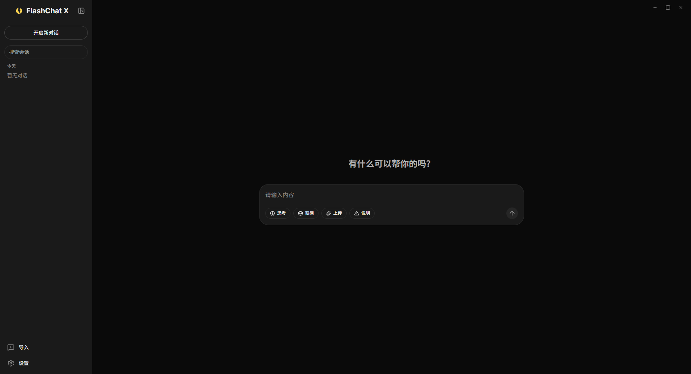
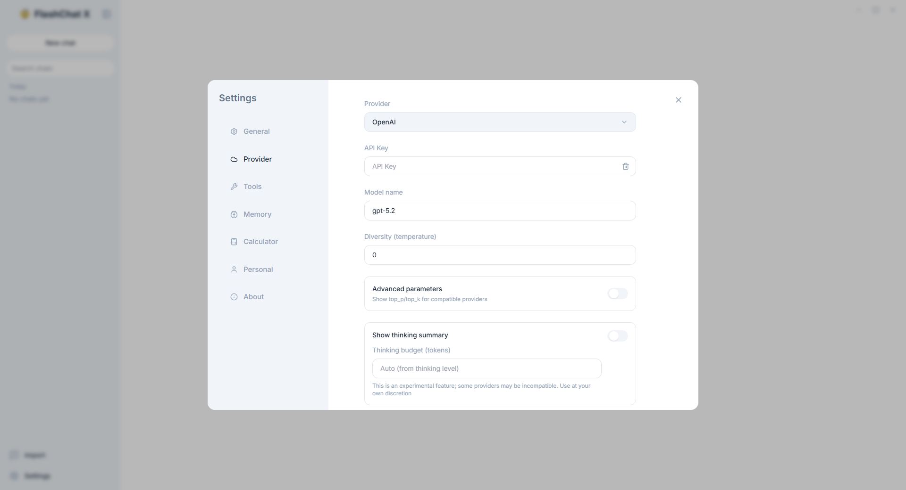

 

## FlashChat X

一个基于 `Vite + React + TypeScript + Electron` 的桌面聊天应用，支持多家大模型供应商，支持最新版本的模型型号、流式输出、思考/推理展示、搜索增强与（可选）MemU 记忆。

### 功能概览

- 多供应商聊天：在设置中选择并配置供应商（API Key/模型/流式/兼容地址等）
- 流式回复与思考展示：边生成边显示；支持思考/推理内容展开折叠与 token 用量统计
- 思考程度与多样性：支持思考程度（低/中/高）、自定义思考预算（tokens）与思考摘要显示/隐藏，并支持回复多样性（temperature）调节
- 统一参数面板：按供应商能力动态显示 temperature/top_p/top_k 等，可按需启用高级参数
- 文件上传：支持将常见文件上传并由模型读取（OpenAI/Gemini/Claude/其他供应商提供工具方式调用识别）
- 插件化工具调用：支持按需启用工具，并可配置可用工具列表与权限
- 对话管理：多会话新建/切换/重命名、置顶、清空，支持对话导入/导出（JSON/Markdown/文本）与会话搜索（按关键词）
- 搜索增强：可选开启搜索辅助回答
- MemU 记忆：可选开启自动保存与相关记忆检索
- 桌面体验：托盘（点击显示/隐藏；菜单含显示/隐藏、退出；关闭/最小化会隐藏到托盘）、窗口按钮（最小化/最大化/关闭）
- 个性化与工具：主题/语言切换、Token/字符换算工具
- 可读错误提示：错误信息会显示具体详情与常见处理方式

### 待实现计划

- ~~统一的“参数面板”：按供应商能力动态显示 temperature/top_p/top_k 等~~
- ~~更细粒度的思考控制：支持自定义预算与显示/隐藏思考摘要~~
- ~~对话导入/导出：支持 JSON/Markdown/文本~~
- ~~会话搜索：按关键词/时间范围检索~~
- ~~插件化工具调用：可配置工具列表与权限~~
- 多窗口与分屏模式：便于对比对话

### 运行方式

1. 安装依赖：`npm i`

2. Web 开发（浏览器）：`npm run dev`

3. Electron 开发：`npm run electron:dev`

4. 构建 Web：`npm run build`

5. 打包 Windows 安装包：`npm run electron:build:win`

### 本地代理（重要）

项目包含一个本地代理服务 `server/proxy.js`（默认端口 `8787`），用于把前端请求转发到各供应商并处理流式 SSE。

- 开发环境：`npm run dev` 会同时启动代理（脚本里包含 `proxy`）
- 打包应用：Electron 主进程会自动启动内置代理，无需手动运行

### 配置与存储

- 供应商配置：在设置对话框中填写 API Key/模型等，配置会存到本机应用的 `localStorage`（按供应商分别保存，并记住当前选中供应商）
- MemU 配置：同样存到 `localStorage`
- `.env.local`：主要用于开发环境的默认配置来源（可选）；打包应用不会依赖/写入项目根目录的 `.env.local`

### 目录结构

- `App.tsx`：应用主逻辑（会话、流式拼接、UI 状态）
- `components/`：界面组件（侧边栏、输入框、设置弹窗等）
- `services/`：各供应商调用与通用工具（通过本地代理请求）
- `server/proxy.js`：本地代理与环境写入（开发态）
- `electron/`：Electron 主进程/预加载脚本与打包资源

```text
flashchat-x/
|-- App.tsx
|-- constants.ts
|-- env.d.ts
|-- eslint.config.js
|-- index.css
|-- index.html
|-- index.tsx
|-- package.json
|-- tsconfig.json
|-- translations.ts
|-- types.ts
|-- vite.config.ts
|-- electron-builder.config.cjs
|-- components/
|   |-- ChatInterface.tsx
|   |-- ConfirmDialog.tsx
|   |-- InfoDialog.tsx
|   |-- InputArea.tsx
|   |-- PlatformLinks.tsx
|   |-- SettingsModal.tsx
|   |-- Sidebar.tsx
|   `-- TitleBar.tsx
|-- contexts/
|   |-- LanguageContext.tsx
|   `-- useTranslation.ts
|-- electron/
|   |-- main.js
|   |-- preload.js
|   `-- icons/
|-- public/
|-- server/
|   `-- proxy.js
|-- services/
|   |-- anthropicService.ts
|   |-- bailingService.ts
|   |-- deepseekService.ts
|   |-- googleService.ts
|   |-- longcatService.ts
|   |-- mimoService.ts
|   |-- memuService.ts
|   |-- minimaxService.ts
|   |-- modelscopeService.ts
|   |-- moonshotService.ts
|   |-- openaiCompatibleService.ts
|   |-- openaiService.ts
|   |-- providerConfig.ts
|   |-- searchService.ts
|   |-- serviceUtils.ts
|   |-- zAIService.ts
|   `-- zIntlService.ts
`-- utils/
    `-- sseParser.ts
```

---

## FlashChat X (English)

A desktop chat application built with `Vite + React + TypeScript + Electron`, supporting multiple LLM providers, the latest model versions, streaming output, thinking/reasoning display, search augmentation, and optional MemU memory.

### Feature Overview

- Multi-provider chat: choose and configure providers in Settings (API Key/model/streaming/compatible base URL, etc.)
- Streaming replies and thinking display: render while generating; support expand/collapse of thinking/reasoning content and token usage stats
- Thinking level & diversity: support thinking level (low/medium/high), custom thinking budget (tokens), thinking summary show/hide, and response diversity (temperature)
- Unified parameter panel: show temperature/top_p/top_k based on provider capabilities, with optional advanced parameters
- File upload: upload common files and let the model read them (OpenAI/Gemini/Claude/other providers via tool calls)
- Pluggable tool calling: enable tools on demand, with configurable tool list and permissions
- Chat management: create/switch/rename multi-sessions, pin, clear; support chat import/export (JSON/Markdown/plain text) and session search (keyword)
- Search augmentation: optional search-assisted answering
- MemU memory: optional auto-save and related memory retrieval
- Desktop experience: tray (click to show/hide; menu includes show/hide and quit; close/minimize hides to tray), window controls (minimize/maximize/close)
- Personalization & tools: theme/language switch, token/character calculator
- Readable error prompts: show detailed error information with common fixes

### Roadmap

- ~~Unified parameter panel: show temperature/top_p/top_k based on provider capabilities~~
- ~~Finer thinking control: support custom budget and show/hide thinking summary~~
- ~~Chat import/export: JSON/Markdown/plain text~~
- ~~Session search: keyword + time range~~
- ~~Pluggable tool calling: configurable tool list and permissions~~
- Multi-window and split view: for comparing chats

### How to Run

1. Install dependencies: `npm i`

2. Web dev (browser): `npm run dev`

3. Electron dev: `npm run electron:dev`

4. Build web: `npm run build`

5. Build Windows installer: `npm run electron:build:win`

### Local Proxy (Important)

This project includes a local proxy service `server/proxy.js` (default port `8787`) to forward frontend requests to providers and handle streaming SSE.

- Development: `npm run dev` starts the proxy (script includes `proxy`)
- Packaged app: Electron main process auto-starts the bundled proxy, no manual run needed

### Configuration & Storage

- Provider config: set API Key/model in Settings; stored in the app’s `localStorage` (per provider and remembers the current provider)
- MemU config: also stored in `localStorage`
- `.env.local`: optional defaults for development; packaged app does not rely on or write to project-root `.env.local`

### Project Structure

- `App.tsx`: main app logic (sessions, streaming assembly, UI state)
- `components/`: UI components (sidebar, input, settings modal, etc.)
- `services/`: provider calls and shared tools (via local proxy)
- `server/proxy.js`: local proxy and environment persistence (dev only)
- `electron/`: Electron main/preload scripts and build resources
